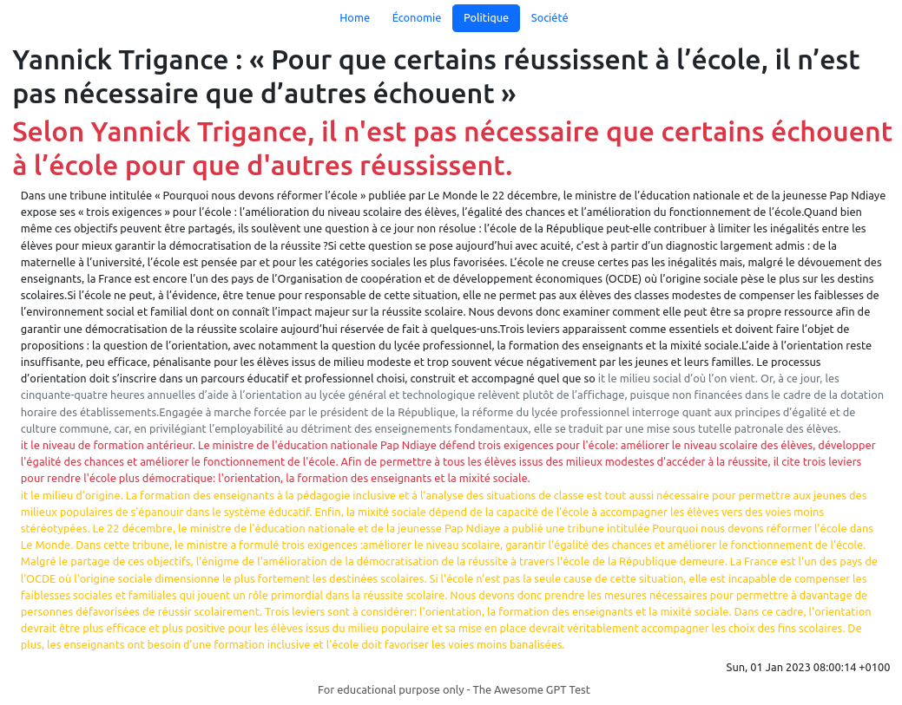

# GPT3 generated news website

This small project is a proof of concept for an automatically generated news website using GPT3.

It's a personal project and work in progress to practice Typescript and explore OpenAI's GPT-3.

We use the RSS feeds of a real news site to generate a navigable website, presenting the categories and articles of the real site, but replacing the text with text autgenerated by GPT3, with the autocompletion API.

We instruct the API to replace, summarize or elabore on a text to generate fake news articles

You have to :

* create a `.env` file based on the `dot.env` provided one and put there your `OPENAI_API_KEY`
* configure your RSS feeds in `src/config.ts`

Generated texts are saved in a `.cache/` folder to minimize the use of the API.

DISCLAIMER: This work is for educational purpose only. You can't use it to create a actual website. Respect intellectual property

With too long paragraphs, an improvement could be run by chunks :

Short sentences are ok :

